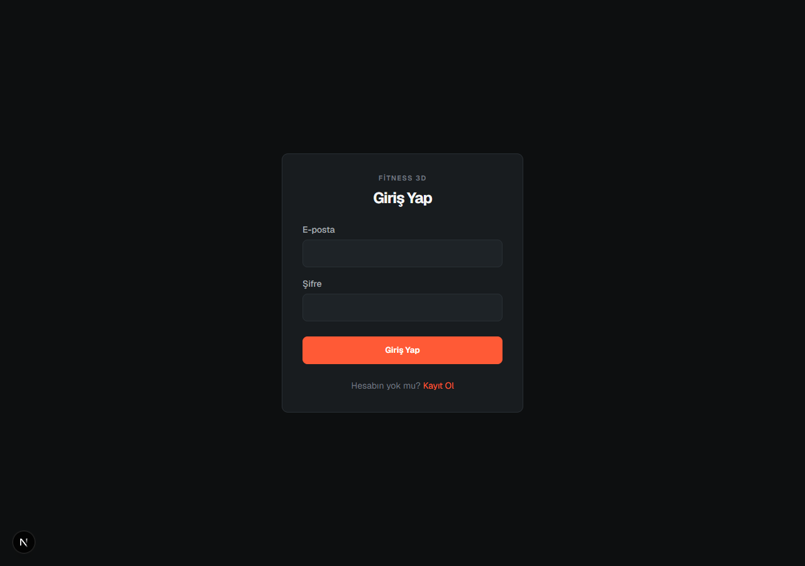

# Fitness 3D

A full-stack fitness tracking web application combining structured workout logging, training analytics, interactive 3D anatomy visualization, body metrics, routines, and private friend profiles.

## Overview

Fitness 3D provides a complete training management workflow designed for mobile-first gym use while leveraging modern WebGL visualization on desktop. Instead of generic logging or exaggerated muscle growth predictions, the application computes deterministic metrics from completed working sets and maps training volume onto an anatomical 3D model.

## Features

- **Workout Routines**: Create, customize, and organize reusable training routines with target rep ranges and exercise ordering.
- **Active Workout Logging**: Rapid set logging optimized for gym usage, distinguishing working sets and warm-up sets with rest timer support.
- **Workout History & PR Tracking**: Detailed session logs, total workout volume tracking, personal record detection, and estimated 1RM calculations (Epley formula).
- **Interactive 3D Anatomy**: WebGL-powered 3D human anatomy viewer built with Three.js and React Three Fiber.
- **Training Exposure Visualization**: Muscle-specific volume heatmap computed deterministically as:
  completed working sets × exercise-muscle contribution factor.
  Provides an app-specific training exposure view across customizable time ranges (7d, 30d, 3m, 6m, 1y).
- **Exercise Catalog**: Categorized exercise library with primary and secondary muscle mappings, equipment requirements, and dedicated home exercise filtering.
- **Body Metrics & Weight History**: Track body weight, height, BMR (Mifflin-St Jeor), and body weight trends over time.
- **Unit Preferences**: Seamless switching between Metric (kg) and Imperial (lb) display preferences, with canonical storage in kilograms.
- **Private Friends System**: Search users by unique username, send/accept friend requests, block list management, and view read-only friend training profiles via secure database RPCs.
- **Turkish-First Interface**: Complete Turkish interface for all user workflows and exercise metadata.
- **Supabase Authentication**: Secure email/password authentication with Row Level Security (RLS) enforcing complete user data isolation.
- **Mobile-First Responsive UI**: Fast touch ergonomics for mobile gym use with expanded multi-column views on larger screens.

## Screenshots

| Interactive 3D Anatomy (Front) | Interactive 3D Anatomy (Muscle Selected) |
| :---: | :---: |
|  |  |

| Interactive 3D Anatomy (Back View) | Exercise Catalog |
| :---: | :---: |
|  |  |

| Exercise Detail | Authentication |
| :---: | :---: |
|  |  |

## Tech Stack

- **Framework**: Next.js (App Router)
- **Frontend**: React, TypeScript, Tailwind CSS
- **3D Graphics**: Three.js, React Three Fiber (`@react-three/fiber`), Drei (`@react-three/drei`)
- **Data & Charts**: Recharts
- **Backend & Database**: Supabase (PostgreSQL, Supabase Auth, Row Level Security)
- **Validation & Math**: Zod, deterministic fitness calculation modules
- **Testing**: Vitest
- **Deployment**: Vercel-ready

## Architecture & Security

- **Row Level Security (RLS)**: Every table in PostgreSQL enforces strict RLS policies. Users can only read and write their own workouts, sets, body metrics, and routines.
- **Controlled Friends RPCs**: Cross-user interactions (friend requests, friend training summaries, search) are executed exclusively through `SECURITY DEFINER` stored procedures with input validation and block checks. Raw friendship and profile tables cannot be directly queried across users.
- **Data Integrity**: Weight values are stored canonically in kilograms (`numeric(5, 2)`). Conversions to pounds are purely presentational.
- **Separation of Concerns**: Calculation logic (1RM estimates, volume totals, exposure factors, unit conversions) is isolated in pure TypeScript functions with automated unit tests, decoupled from presentation components.

## 3D Anatomy

Body 3D renders an optimized real-time 3D model with 102 tracked skeletal muscle meshes and anatomical context geometry. Selecting any muscle group highlights the anatomy and displays recent training exposure and related exercises.

For model origins, mesh mappings, and licensing details, see [THIRD_PARTY_ASSETS.md](THIRD_PARTY_ASSETS.md). The runtime 3D asset incorporates data derived from BodyExplorer (BodyParts3D, CC BY-SA 2.1 JP) and Z-Anatomy (CC BY-SA 4.0).

## Roadmap (Future / In Progress)

- [ ] Animated 3D exercise demonstrations
- [ ] Male and female exercise models
- [ ] Initial animation package focused on home workouts
- [ ] Continued exercise library and anatomical muscle coverage expansion

## Running Locally

### Prerequisites

- Node.js 20+
- npm

### Installation

1. Clone the repository:
   ```bash
   git clone https://github.com/your-username/fitness-3d.git
   cd fitness-3d
   ```

2. Install dependencies:
   ```bash
   npm install
   ```

3. Configure environment variables:
   Copy the example environment file:
   ```bash
   cp .env.example .env.local
   ```
   Provide your Supabase project credentials in `.env.local`:
   - `NEXT_PUBLIC_SUPABASE_URL`
   - `NEXT_PUBLIC_SUPABASE_PUBLISHABLE_KEY`

4. Start the development server:
   ```bash
   npm run dev
   ```

   Open [http://localhost:3000](http://localhost:3000) in your browser.

## Tests & Verification

Run the test suite, linter, and production build:

```bash
# Run unit tests
npx vitest run

# Run linter
npm run lint

# Run production build
npm run build
```

## License

This project source code is available under the MIT License. See [THIRD_PARTY_ASSETS.md](THIRD_PARTY_ASSETS.md) for third-party 3D asset licenses.
