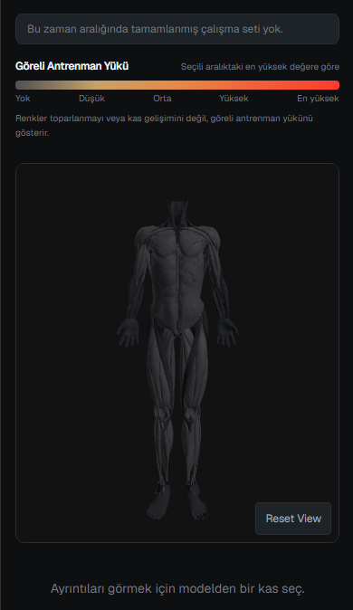
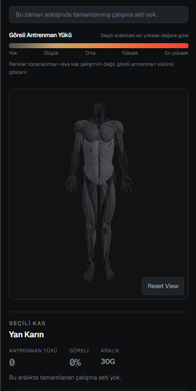
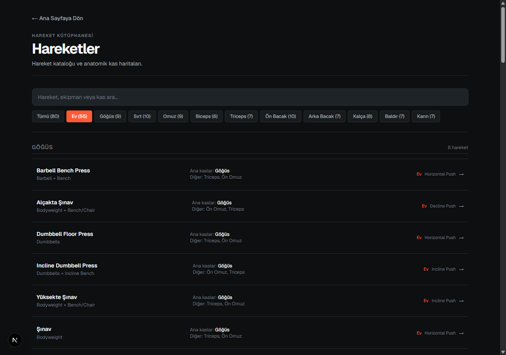
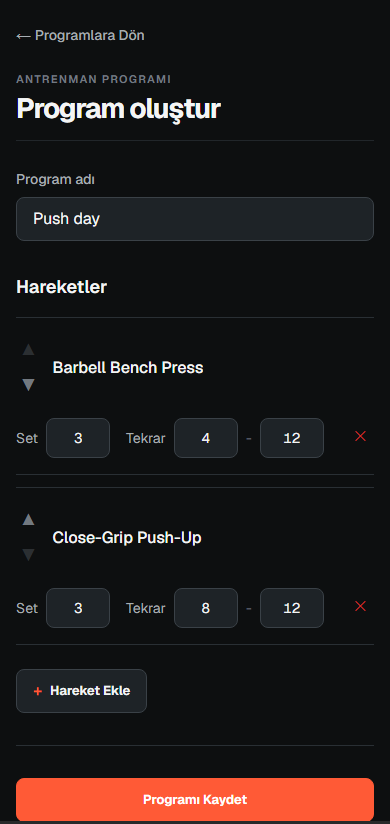
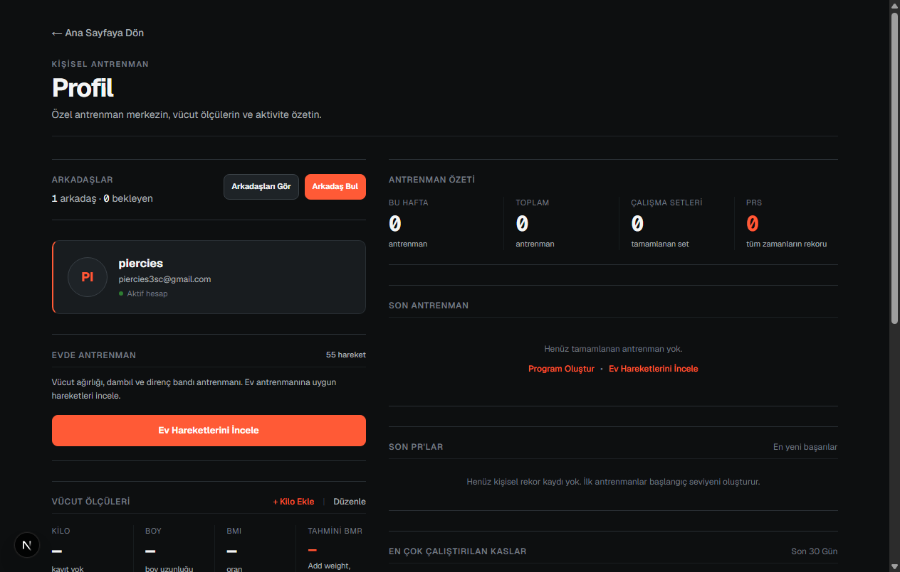

English | [Türkçe](README_TR.md)

# Fitness 3D

A personal full-stack web project built to explore workout tracking, data visualization, and interactive 3D graphics in the browser. It combines workout logging, routines, body metrics, and a WebGL-based human anatomy model to visualize training exposure across muscle groups.

Built as a student portfolio project to practice working with Next.js, Supabase, PostgreSQL, and Three.js.

## Features

- **Workout routines**: Create, edit, and organize reusable workout routines.
- **Active workout logging**: Track working sets and warm-up sets with an integrated rest timer.
- **Workout history**: View previous sessions with total volume and set details.
- **PR tracking & estimated 1RM**: Track personal records and calculate estimated 1RM using the Epley formula.
- **Training volume**: Track session and exercise volume over time.
- **Interactive 3D anatomy**: Real-time 3D anatomical model with selectable muscle groups.
- **Training Exposure visualization**: Color-coded volume visualization mapped onto the 3D model across customizable time ranges (7d, 30d, 3m, 6m, 1y).
- **Exercise catalog**: Library of exercises with muscle contributions, equipment types, and instructions.
- **Home exercise filtering**: Dedicated filter for bodyweight, dumbbell, and band exercises.
- **Body metrics & weight history**: Log body weight over time, track height, and view estimated BMR (Mifflin-St Jeor).
- **kg/lb preference**: Switch between Metric (kg) and Imperial (lb) units, with canonical storage in kilograms.
- **Private friends system**: Search users by username, send/accept requests, and view read-only friend training profiles.
- **Turkish-first interface**: Primary interface and navigation designed in Turkish.

## Screenshots

| 1. Body 3D (Front View) | 2. Body 3D (Back View) |
| :---: | :---: |
|  |  |

| 3. Selected Muscle / Training Exposure | 4. Exercise Catalog |
| :---: | :---: |
|  |  |

| 5. Exercise Detail | 6. Profile |
| :---: | :---: |
|  |  |

## Tech Stack

- **Framework**: Next.js (App Router)
- **Frontend**: React, TypeScript, Tailwind CSS
- **3D Graphics**: Three.js, React Three Fiber, Drei
- **Charts**: Recharts
- **Database & Auth**: Supabase (PostgreSQL, Supabase Auth, RLS)
- **Testing**: Vitest
- **Deployment**: Vercel

## Training Exposure

Training Exposure is an app-specific visualization calculated as:

$$\text{Exposure} = \sum (\text{completed working sets} \times \text{exercise-muscle contribution factor})$$

This provides a comparative visual guide on the 3D model relative to the most trained muscle in the selected time window. It is a training volume representation, not a biological simulation of muscle growth or recovery.

## 3D Anatomy

The 3D viewer renders an anatomical model with 102 tracked skeletal muscle meshes alongside context geometry. Selecting a muscle group highlights it and displays recent training data and associated exercises.

For model sources, licenses, and attribution, see [THIRD_PARTY_ASSETS.md](THIRD_PARTY_ASSETS.md). The model uses open data derived from BodyExplorer (BodyParts3D, CC BY-SA 2.1 JP) and Z-Anatomy (CC BY-SA 4.0).

## Security & Data Privacy

- **Authentication**: Handled via Supabase Auth.
- **Row Level Security (RLS)**: User-owned and social data is protected with RLS and controlled RPCs.
- **Private Data**: Body weight and metric logs are strictly accessible only by the account owner.
- **Friends RPCs**: Cross-user interactions (friend requests, read-only summaries) use `SECURITY DEFINER` database functions with block checks.

## Roadmap (Planned)

The following items are planned for future iterations:

- Animated 3D exercise demonstrations
- Male and female exercise models
- First animation package focused on home workouts
- Broader exercise library
- Improved anatomical muscle coverage
- Further UI/UX polish

## Running Locally

### Prerequisites

- Node.js 20+
- npm

### Setup

1. Clone the repository:
   ```bash
   git clone https://github.com/Piercies3sc/fitness-3d.git
   cd fitness-3d
   ```

2. Install dependencies:
   ```bash
   npm install
   ```

3. Configure environment variables:
   ```bash
   cp .env.example .env.local
   ```
   Add your Supabase credentials to `.env.local`:
   - `NEXT_PUBLIC_SUPABASE_URL`
   - `NEXT_PUBLIC_SUPABASE_PUBLISHABLE_KEY`

4. Run the development server:
   ```bash
   npm run dev
   ```

   Open [http://localhost:3000](http://localhost:3000) in your browser.

## Tests & Verification

```bash
# Run unit tests
npx vitest run

# Run linter
npm run lint

# Run production build
npm run build
```

## License

The source code is licensed under the MIT License. See [THIRD_PARTY_ASSETS.md](THIRD_PARTY_ASSETS.md) for 3D asset licenses and attribution.
