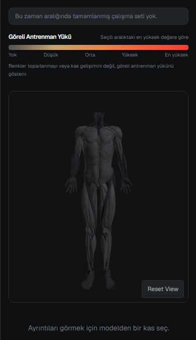
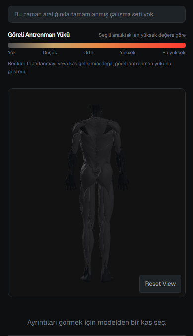
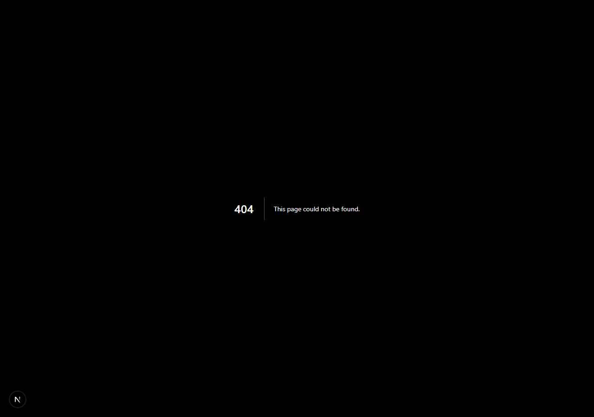
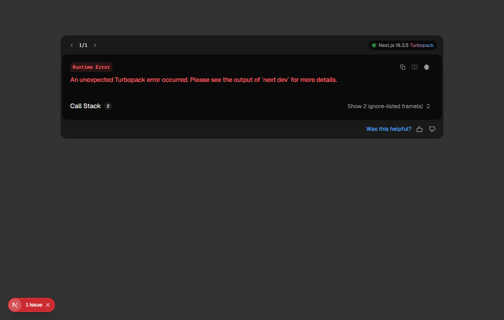

[English](README.md) | Türkçe

# Fitness 3D

Antrenman takibi, veri görselleştirme ve tarayıcı tabanlı 3D grafikleri pratik etmek amacıyla geliştirilmiş kişisel bir full-stack web projesi. Antrenman kaydı, program yönetimi, vücut ölçüleri ve kas grupları üzerindeki antrenman hacmini görselleştiren WebGL tabanlı bir 3D anatomi modelini bir araya getirir.

Next.js, Supabase, PostgreSQL ve Three.js teknolojilerini deneyimlemek üzere öğrenci portfolyosu kapsamında hazırlanmıştır.

## Özellikler

- **Antrenman programları**: Tekrar kullanılabilir antrenman programları oluşturma, düzenleme ve sıralama.
- **Aktif antrenman kaydı**: Çalışma ve ısınma setlerini dinlenme sayacı eşliğinde hızlıca kaydetme.
- **Antrenman geçmişi**: Geçmiş antrenman oturumlarını, set detaylarını ve toplam hacmi inceleme.
- **PR takibi ve tahmini 1RM**: Kişisel rekorları kaydetme ve Epley formülü ile tahmini 1RM hesaplama.
- **Antrenman hacmi**: Egzersiz ve oturum bazında toplam hacim takibi.
- **Etkileşimli 3D anatomi**: Seçilebilir kas gruplarına sahip gerçek zamanlı 3D anatomi modeli.
- **Antrenman Yükü görselleştirmesi**: Farklı zaman aralıklarında (7g, 30g, 3a, 6a, 1y) kas grupları üzerindeki antrenman yoğunluğunu renkli harita olarak model üzerinde gösterme.
- **Hareket kütüphanesi**: Birincil ve ikincil kas katılımları, ekipman türleri ve açıklamaları içeren egzersiz kataloğu.
- **Ev antrenmanı filtresi**: Vücut ağırlığı, dambıl ve direnç bandı hareketlerini kolayca filtreleme.
- **Vücut ölçüleri ve kilo geçmişi**: Kilo geçmişi kaydı, boy takibi ve tahmini BMR (Mifflin-St Jeor) hesaplama.
- **kg/lb tercihi**: Arayüzde kg ve lb arasında geçiş yapabilme (veritabanında kg olarak saklanır).
- **Özel arkadaşlık sistemi**: Kullanıcı adına göre arama, istek gönderme/kabul etme ve salt okunur arkadaş antrenman profili görüntüleme.
- **Türkçe öncelikli arayüz**: Tüm kullanıcı deneyimi ve temel akışlar için Türkçe arayüz.

## Ekran Görüntüleri

| 1. 3D Anatomi (Ön Görünüm) | 2. 3D Anatomi (Arka Görünüm) |
| :---: | :---: |
|  |  |

| 3. Seçili Kas / Antrenman Yükü | 4. Hareket Kütüphanesi |
| :---: | :---: |
|  |  |

| 5. Hareket Detayı | 6. Profil |
| :---: | :---: |
|  |  |

| 7. Arkadaşlar | |
| :---: | :---: |
|  | |

## Kullanılan Teknolojiler

- **Framework**: Next.js (App Router)
- **Frontend**: React, TypeScript, Tailwind CSS
- **3D Grafikler**: Three.js, React Three Fiber, Drei
- **Grafikler**: Recharts
- **Veritabanı & Auth**: Supabase (PostgreSQL, Supabase Auth, RLS)
- **Test**: Vitest
- **Dağıtım**: Vercel

## Antrenman Yükü (Training Exposure)

Antrenman Yükü, uygulama içinde şu formülle hesaplanan deterministik bir hacim göstergesidir:

$$\text{Antrenman Yükü} = \sum (\text{tamamlanan çalışma setleri} \times \text{hareket-kas katkı faktörü})$$

Seçilen zaman diliminde en çok çalıştırılan kasa göre orantılanarak 3D model üzerinde renk geçişleriyle sunulur. Bu gösterge antrenman hacmini görselleştirmeye yöneliktir; doğrudan kas gelişimi veya toparlanma (recovery) iddiasında bulunmaz.

## 3D Anatomi

3D görüntüleyici, 102 adet takip edilen iskelet kası parçasını ve anatomik çevre dokuları gerçek zamanlı olarak tarayıcıda işler. Bir kas grubuna tıklandığında ilgili kas vurgulanır, son dönem antrenman verisi ve o kasa yönelik egzersizler listelenir.

Model kaynakları, lisanslar ve atıflar için [THIRD_PARTY_ASSETS.md](THIRD_PARTY_ASSETS.md) dosyasını inceleyebilirsiniz. Model, BodyExplorer (BodyParts3D, CC BY-SA 2.1 JP) ve Z-Anatomy (CC BY-SA 4.0) açık kaynak projelerinden türetilmiştir.

## Güvenlik ve Veri Gizliliği

- **Kimlik Doğrulama**: Supabase Auth ile yönetilir.
- **Satır Düzeyinde Güvenlik (RLS)**: Kullanıcıya ait veriler ve sosyal etkileşimler RLS ve kontrollü RPC fonksiyonlarıyla korunur.
- **Kişisel Veri**: Kilo ve vücut ölçüleri yalnızca hesap sahibinin erişimine açıktır.
- **Arkadaşlık RPC'leri**: Kullanıcılar arası veri paylaşımı ve istekler, engelleme kontrolleri içeren `SECURITY DEFINER` veritabanı fonksiyonları üzerinden yürütülür.

## Gelecek Planları (Roadmap)

İlerleyen aşamalarda eklenmesi planlanan özellikler:

- 3D hareket animasyonları
- Kadın ve erkek egzersiz modelleri
- Ev antrenmanlarına odaklanan ilk animasyon paketi
- Daha geniş egzersiz kütüphanesi
- Geliştirilmiş anatomik kas kapsamı
- Arayüz ve etkileşim iyileştirmeleri

## Yerel Kurulum

### Gereksinimler

- Node.js 20+
- npm

### Kurulum Adımları

1. Depoyu klonlayın:
   ```bash
   git clone https://github.com/Piercies3sc/fitness-3d.git
   cd fitness-3d
   ```

2. Bağımlılıkları yükleyin:
   ```bash
   npm install
   ```

3. Çevre değişkenlerini ayarlayın:
   ```bash
   cp .env.example .env.local
   ```
   `.env.local` dosyasına Supabase proje bilgilerinizi ekleyin:
   - `NEXT_PUBLIC_SUPABASE_URL`
   - `NEXT_PUBLIC_SUPABASE_PUBLISHABLE_KEY`

4. Geliştirme sunucusunu başlatın:
   ```bash
   npm run dev
   ```

   Tarayıcınızda [http://localhost:3000](http://localhost:3000) adresine gidin.

## Testler ve Doğrulama

```bash
# Birim testleri çalıştırma
npx vitest run

# Linter kontrolü
npm run lint

# Üretim derlemesi
npm run build
```

## Lisans

Kaynak kodlar MIT Lisansı altındadır. 3D model lisansları ve atıfları için [THIRD_PARTY_ASSETS.md](THIRD_PARTY_ASSETS.md) dosyasına bakınız.
